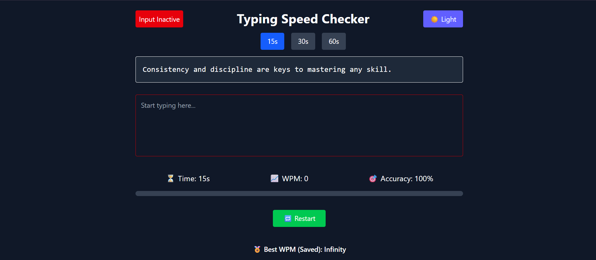
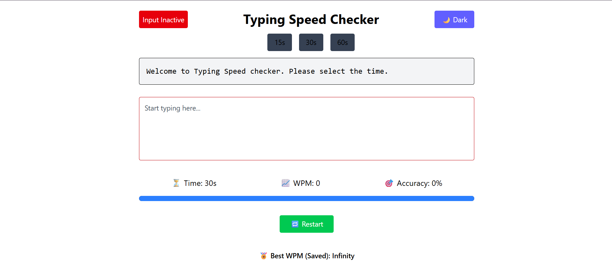

# 🧠 Typing Speed Checker

A fast, responsive, and beautifully designed **Typing Speed Checker App** built using **React** and **Tailwind CSS**. Practice typing with real-time feedback, live stats, dark/light theme, and custom test durations.

---

## 🔗 Live Demo

👉 [https://typing-speed-checker-delta.vercel.app/](https://typing-speed-checker-delta.vercel.app/)

---

## 📸 Screenshots

| Dark Mode                                 | Light Mode                                  |
| ----------------------------------------- | ------------------------------------------- |
|  |  |

---

## 🚀 Features

- ⌨️ Typing area with real-time input highlighting
- ⏱️ Selectable duration: 15s, 30s, or 60s
- 🔄 Random sentences pulled from a JSON file
- 📊 Live stats: WPM (Words Per Minute) and Accuracy
- 🟢 Input active/inactive indicator
- 🌙 Dark / Light mode toggle with memory
- 🏅 Best WPM saved in localStorage
- ⚡ Animated progress bar
- 🎯 Clean, responsive UI with Tailwind CSS

---

## 🧰 Tech Stack

- ⚛️ [React](https://reactjs.org/) — Frontend JavaScript library
- 💨 [Tailwind CSS](https://tailwindcss.com/) — Utility-first CSS framework
- ⚙️ [Vite](https://vitejs.dev/) — Lightning fast build tool

---

## 🧪 Getting Started

### 📦 Installation

Clone the repo :

```bash
git clone https://github.com/PARTHA-PATTANAYAK-02/typing-speed-checker.git
cd typing-speed-checker
```

install dependencies:

```bash
npm install
```

also see the package.json

Run the development server :

```bash
npm run dev
```

---

## 🌐 Deployment

## This project can be deployed easily using: Vercel

## ✍️ Author

**Made with ❤️ by [Partha Pattanayak](https://github.com/PARTHA-PATTANAYAK-02)**
